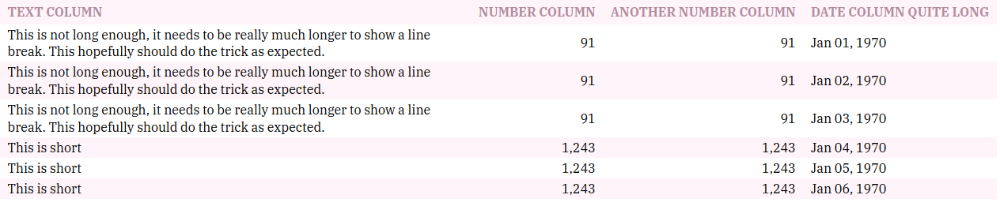

# table_styler

This is a simple custom styler for tables, inspired by [this Medium post](https://medium.com/mission-log/design-better-data-tables-430a30a00d8c#.ic09ganga) and [this UX talk](https://www.youtube.com/watch?feature=youtu.be&v=7Z9rrryIOC4&app=desktop), based on the following rules:
- text (and dates) items should be aligned left;
- headings should be easily recognized from the items.

The following example
```python
(
    TableStyler(
        pandas.DataFrame(
            data={
                "Text column": 3
                * [
                    "This is not long enough, it needs to be really much longer to show a line break. This hopefully should do the trick as expected."
                ]
                + 3 * ["This is short"],
                "Number column": 3 * [91] + 3 * [1243],
                "Another Number column": 3 * [91] + 3 * [1243],
                "Date column quite long": pandas.date_range(
                    start="1970-01-01", periods=6, freq="d"
                ),
            }
        )
        .hide_index()
        .format_columns(numerical_format="{:,}", date_format="{:%b %d, %Y}")
        .render()
    )
)
```
will render in a browser as




